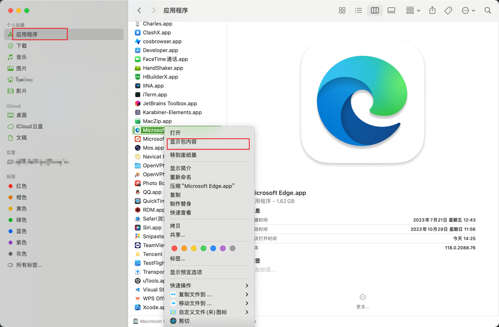
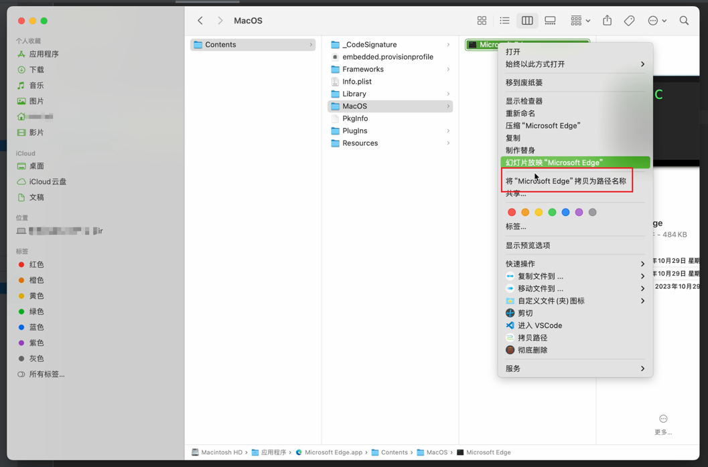
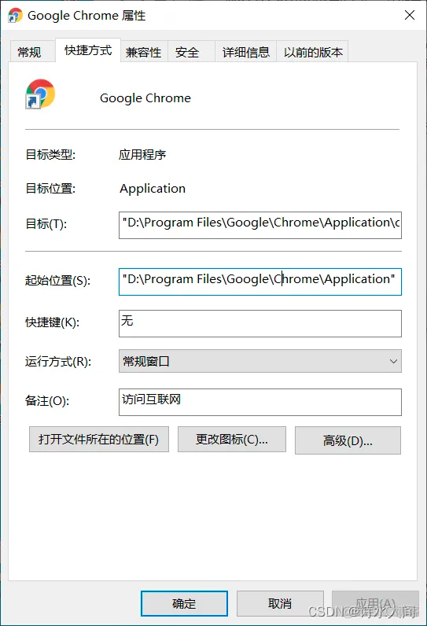
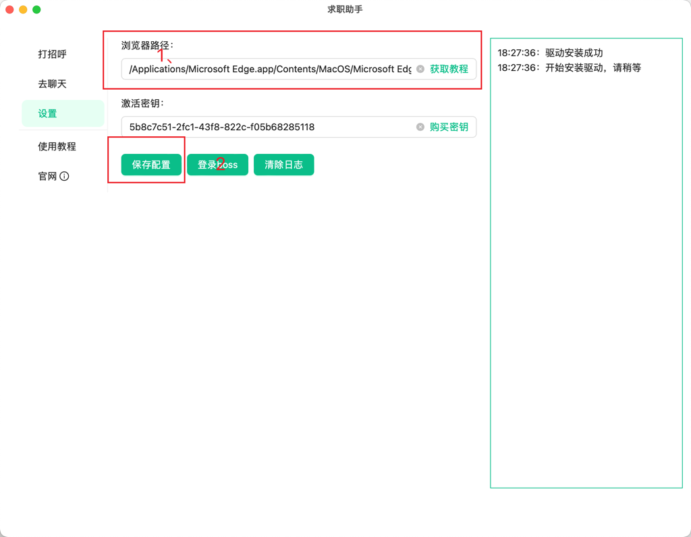

# 浏览器路径获取
---

### 说明

**需要使用edge浏览器，或者chrome浏览器，其他浏览器暂不支持**

### 下载地址

[Chrome浏览器](https://www.google.cn/chrome/index.html)  
[Edge浏览器](https://www.microsoft.com/zh-cn/edge/download?form=MA13FJ)

### mac

找到浏览器应用程序，右键点击，选择`显示包内容`，进入`Contents/MacOS`目录

找到和浏览器同名的文件，右键点击，按住`option`键，选择`复制“xxx”为路径名`，即可获取路径

### windows

找到浏览器应用程序，右键点击，选择`属性`，进入`快捷方式`标签页

复制`目标`字段，即可获取路径

### 保存到软件配置

