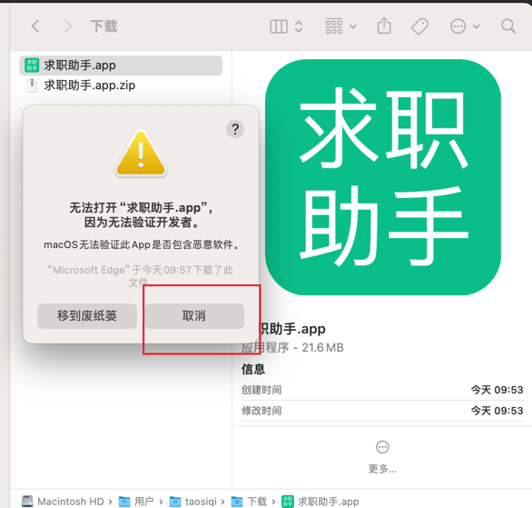

# 提示以损坏和无法验证开发者
---

### 常见的几种报错

- `求职助手.app`已损坏，无法打开，你应该将它移到废纸篓解决办法
- 打不开 `求职助手.app`，因为它来自身份不明的开发者
- 打不开`求职助手.app`，因为 `Apple` 无法检查其是否包含恶意软件  

### 为什么会出现？

这是 `macOS` 启用了新的安全机制的问题。 苹果默认是只允许安装自家`App Store`来源的应用，
如果你想安装第三方的应用，那么需要在`系统偏好设置 -> 隐私与安全性 -> 安全性`中勾选
`App Store 和被认可的开发者`选项。而被认可的开发者是需要购买苹果的昂贵的企业证书对应用进行签名，
然后再提交给苹果审核才可以。

### 解决方法

1.出现下图，点击`取消`

##### 

2.先打开 `系统偏好设置 -> 隐私与安全性 -> 安全性`选项卡，检查是否已经启用了`任何来源`或者`App Store和被认可的开发者`选项，然后点击`任要打开`

##### 

3. 再次点击`打开`，即可成功运行

##### 

