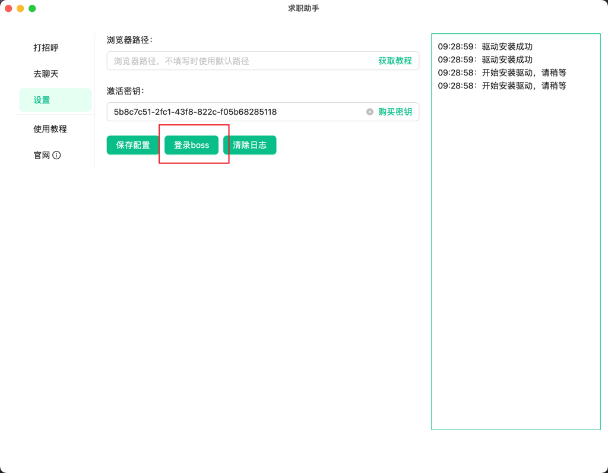
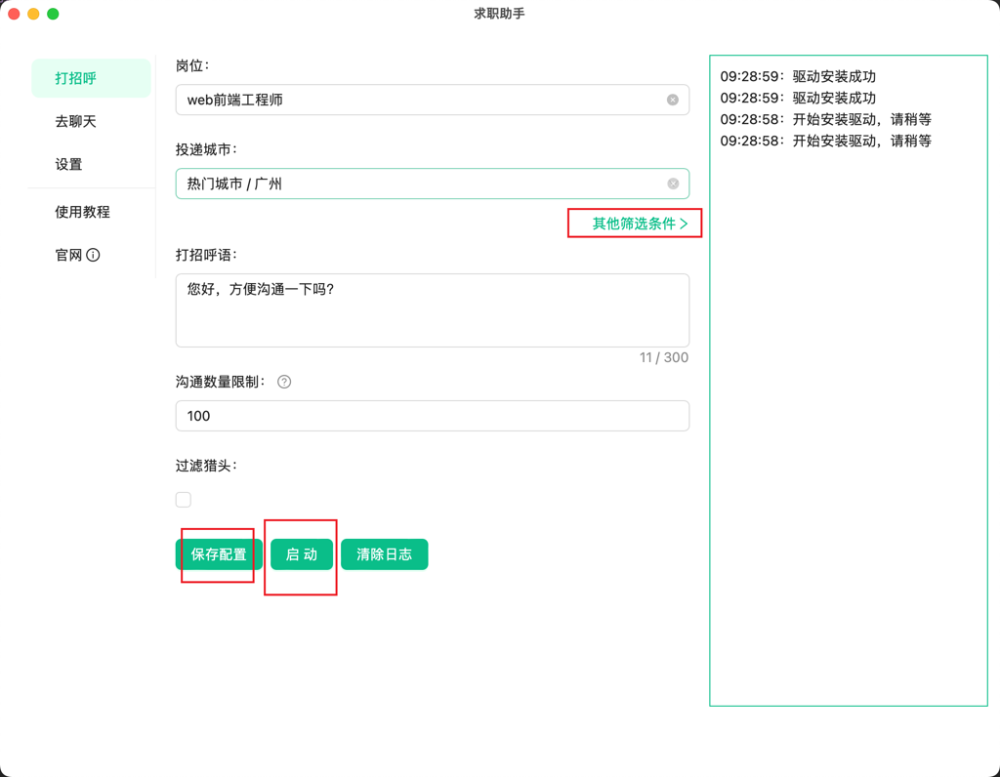
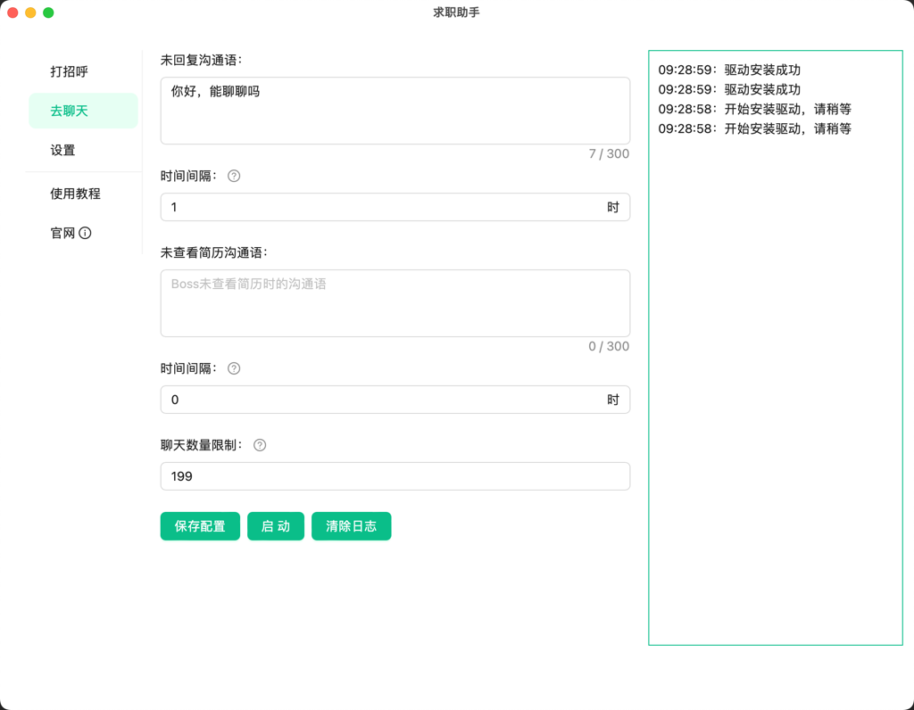
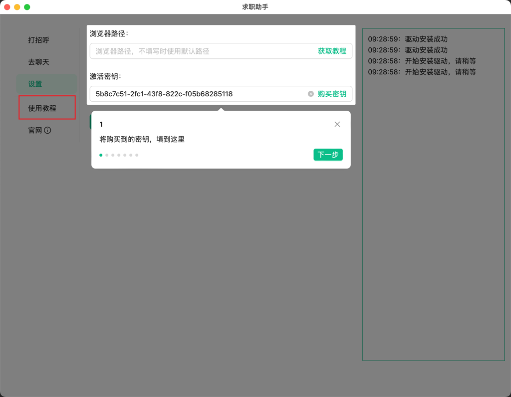
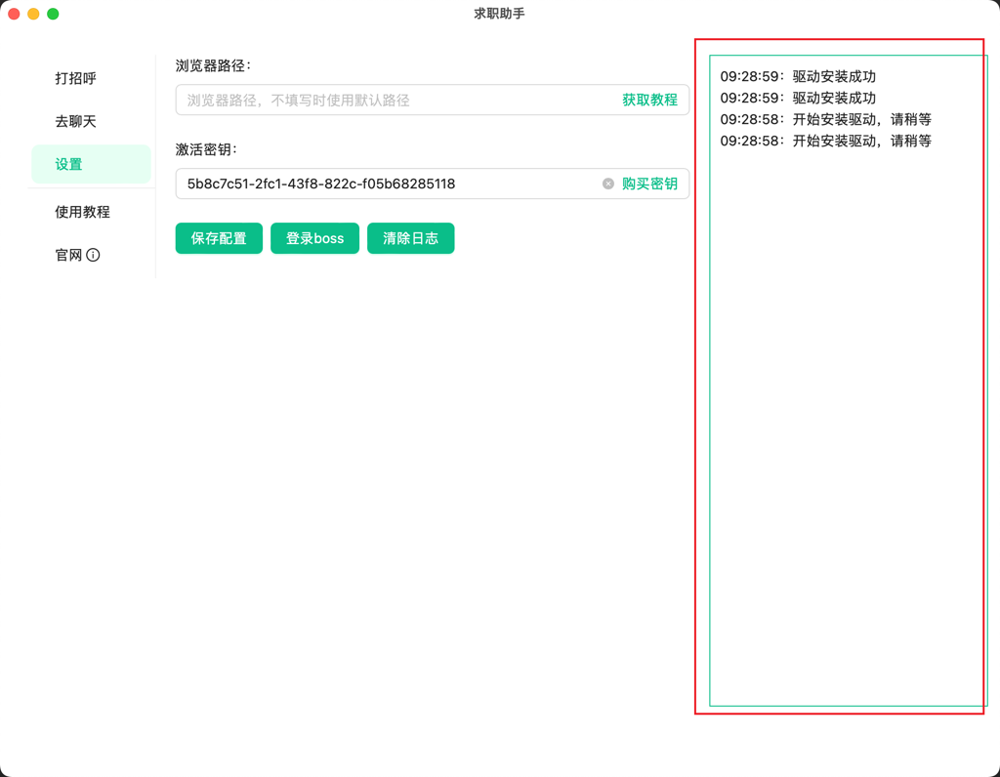

# 使用教程
---
**使用软件前，请确保以关闭所有浏览器，否则会导致软件无法正常使用**

## 登陆Boss
1. 首次使用需要登陆`Boss直聘`，点击页面`登陆boss`按钮，自动打开浏览器，登陆成功后，点击`停止`自动关闭浏览器  

## 打招呼配置
1. 岗位、投递城市、打招呼语三项为必填，其他请按需填入
2. 配置填写完成后，点击`保存配置`，方便后续使用
3. 点击`启动`按钮，开始自动投递
4. 投递完成后，会自动关闭浏览器，或手动点击`停止`  

## 去聊天配置
1. 当我们`发送沟通信息`或`投递简历`之后，`Boss`在指定`时间间隔`未回复我们时，可使用该功能，继续和`Boss`沟通
2. 对于上述两种情况，分别设置`沟通语`，和`时间间隔`
3. 点击`启动`按钮，开始继续聊天
4. 聊天完成后，会自动关闭浏览器，或手动点击`停止`  

## 其他功能
1. 点击使用教程，获取详细使用步骤  

2. 日志分区，可查看运行中的日志信息，请多关注  

